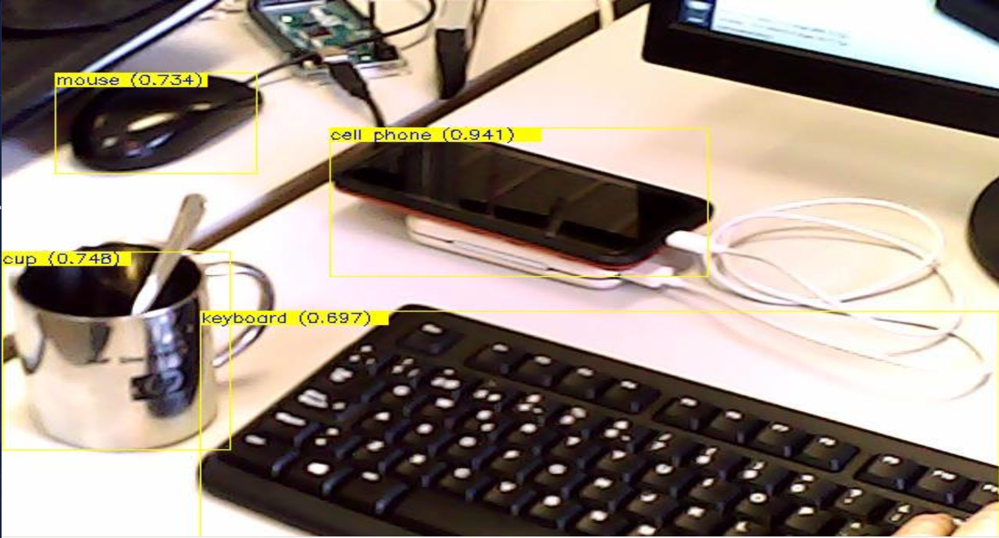

[](https://github.com/davidvelascogarcia/tensorflowLiteDetection2D/tree/develop/programs) [](https://github.com/davidvelascogarcia/tensorflowLiteDetection2D/tags) [](https://travis-ci.org/davidvelascogarcia/tensorflowLiteDetection2D)

# Tensorflow: Detector 2D (Python API)

- [Introduction](#introduction)
- [Trained Models](#trained-models)
- [Requirements](#requirements)
- [Status](#status)
- [Related projects](#related-projects)


## Introduction

`tensorflowLiteDetection2D` module use `tensorflow lite` Python API. The module detects using pre-trained models like `VGG16`, `Inception`, `ResNet`, `MobileNet` and other [pre-trained models](https://storage.googleapis.com/download.tensorflow.org/models/tflite/coco_ssd_mobilenet_v1_1.0_quant_2018_06_29.zip). Also use `YARP` to send video source pre and post-procesed. Also admits `YARP` source video like input. The module has been tested with [ssd_mobilenet_v1_1.0_coco](https://storage.googleapis.com/download.tensorflow.org/models/tflite/coco_ssd_mobilenet_v1_1.0_quant_2018_06_29.zip). This module also publish detection results in `YARP` port with object coordinates.

<p align="center">
  
  <br>Figure 1. Detection example</br>
</p>


## Trained Models

`tensorflowLiteDetection2D` requires a model to detect. Models should be located in [models](./models) dir. 

## Running software

1. Create or configure YARP Server.
```bash
yarp server

yarp conf pc-ip 10000
```
2. Execute [script/tensorflowLiteDetection2D.py](./programs) the detector.
```python
python3 tensorflowLiteDetection2D.py
```
3. Connect video source to `tensorflowLiteDetection2D`.
```bash
yarp connect /videoSource /tensorflowLiteDetection2D/img:i
```

NOTE:

- Video results are published on `/tensorflowLiteDetection2D/img:o`
- Data results are published on `/tensorflowLiteDetection2D/data:o`
- Coordinate results are published on `/tensorflowLiteDetection2D/coord:o`


## Requirements

`tensorflowLiteDetection2D` requires:

* Install OpenCV
```bash
pip3 install opencv-python==3.4.6.27
```
* [Install YARP 2.3.XX+](https://github.com/roboticslab-uc3m/installation-guides/blob/master/install-yarp.md) with Python 3 bindings
* [Install pip3](https://github.com/roboticslab-uc3m/installation-guides/blob/master/install-pip.md)
* Install tensorflow:

```bash
pip3 install tensorflow
```

Tested on: `ubuntu 14.04`, `ubuntu 16.04`, `ubuntu 18.04`, `lubuntu 18.04` and `raspbian`.


## Status

[](https://travis-ci.org/davidvelascogarcia/tensorflowLiteDetection2D)

[](https://github.com/davidvelascogarcia/tensorflowLiteDetection2D/issues)

## Related projects

* [ageitgey: face_recognition project](https://github.com/ageitgey/face_recognition)
* [davidvelascogarcia: Tensorflow: Detector 2D (C++ API)](https://github.com/davidvelascogarcia/tensorflowDetection2D)
* [EdjeElectronics: TensorFlow-Lite-Object-Detection-on-Android-and-Raspberry-Pi](https://github.com/EdjeElectronics/TensorFlow-Lite-Object-Detection-on-Android-and-Raspberry-Pi)
